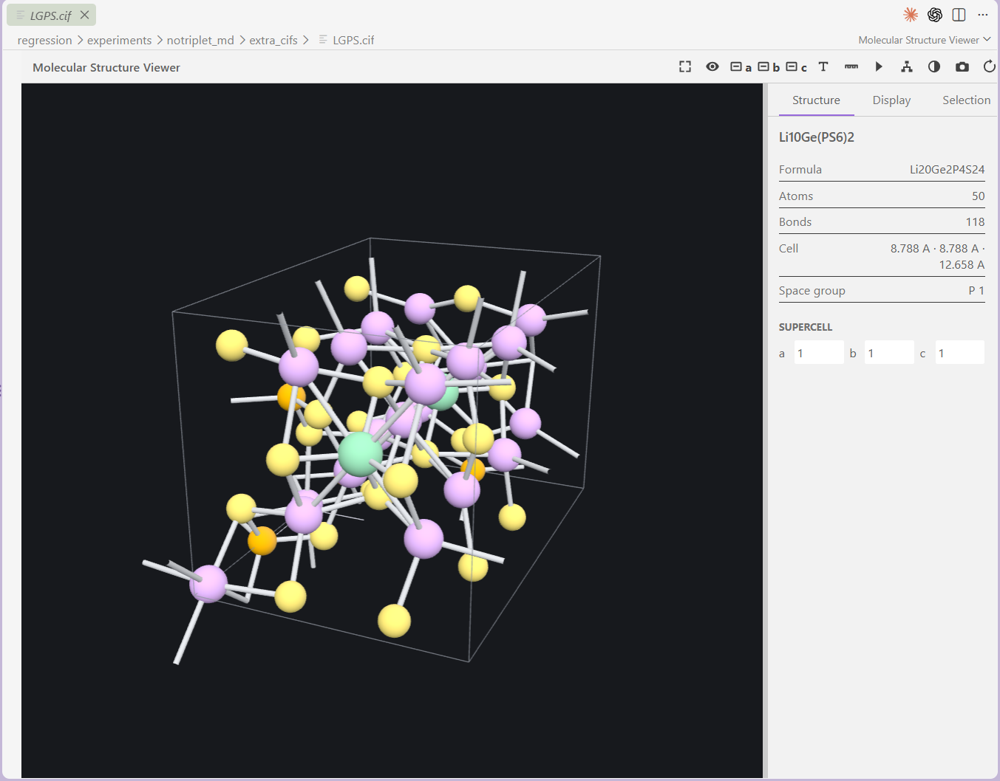

# MoLaView

Open molecular and crystal structure files directly in a Visual Studio Code editor tab and inspect them in interactive 3D.

Built for local and Remote SSH materials workflows: no Python environment, no external application, no server, and no network access. The extension has **no runtime dependencies** and the whole package is about 35 KB.

## Features

- **3D structure view** with ball-and-stick, sticks, and space-filling representations
- **Crystal support** including unit cells, lattice-axis alignment, and on-the-fly supercell expansion
- **Trajectories** with play, pause, step, scrub, speed, and loop controls
- **Measurements** for distance, angle, and dihedral between picked atoms
- **Inspectors** for composition, lattice details, metadata, element visibility, and bond-detection tolerance
- **PNG export** of the current view
- Perspective and orthographic projection, atom labels, and a light/dark canvas toggle



## Install in VSCode

Clone the repository, build the package, and install it:

```bash
git clone https://github.com/linhlathuy/molaview
cd molaview/
npm install
npm run build
npx @vscode/vsce package
code --install-extension molaview-1.0.0.vsix
```

See [docs/INSTALL.md](docs/INSTALL.md) for the full guide, including Remote SSH notes.

Test the view with structures and trajectories in  ```test_structures```.
## Repository Layout

```
src/        extension host code
webview/    viewer UI and WebGL renderer
playwright/ end-to-end tests
config/     esbuild and Playwright configuration
docs/       install guide, changelog, notices
```

Build and test from the project root:

```bash
npm run build      # bundle into dist/
npm run typecheck  # tsc --noEmit
npm run test:e2e   # Playwright end-to-end tests
npm run verify     # all three
```

## Supported Files

- CIF, including cell parameters and common symmetry-operation loops
- VASP `POSCAR`, `CONTCAR`, and `.vasp`, including suffixed names such as `POSCAR_1`
- VASP `XDATCAR` trajectories
- XYZ and extXYZ, including multiple frames and `Lattice` metadata
- PDB and ENT, including multiple `MODEL` records and `CONECT` bonds
- V2000 MOL and SDF, including multiple SDF records
- ASE ULM `.traj`

Supported files open in the viewer by default. Use **Reopen Editor With... > Text Editor** or **Molecular Viewer: Reopen as Text** to inspect the source.

ASE trajectories expose at most 11 representative structures: the first frame, the nearest frame at each 10% interval, and the last frame. Duplicate indices are removed for short trajectories. The playback label always shows both the sample position and original trajectory frame.

## Controls

- Left drag rotates, right drag pans, and the wheel zooms.
- The top toolbar fits the structure, changes projection, aligns along lattice axes, toggles labels, selects distance/angle/dihedral measurement modes, changes the canvas background, saves a PNG, and resets the viewer.
- The **Structure** inspector shows composition, lattice details, metadata, and supercell controls.
- The **Display** inspector changes representation, sizes, visible geometry, element visibility, and inferred-bond tolerance.
- The **Selection** inspector shows picked atoms and completed measurements.
- Multi-frame files display play, pause, step, scrub, speed, frame, and loop controls.

## Offline and Remote Use

All parsers, WebGL rendering code, styles, and icons are bundled in the VSIX. The extension does not make network requests or launch external programs. In Remote SSH sessions, file parsing runs in the remote workspace extension host and the interactive editor is rendered by the local VS Code client.

## Current Scope

The first release is a read-only atomic-structure viewer. It does not display volumetric density, edit atoms, export modified structure files, parse V3000 MOL records, or read obsolete pickle-based ASE trajectories. CIF support targets the common structural subset and reports unsupported or malformed variants instead of guessing coordinates.

## VESTA Reference Boundary

VESTA informed the workflow and terminology only. This extension does not contain, modify, call, or redistribute VESTA code, binaries, configuration, or artwork. VESTA remains a separate copyrighted application by Koichi Momma and Fujio Izumi.
